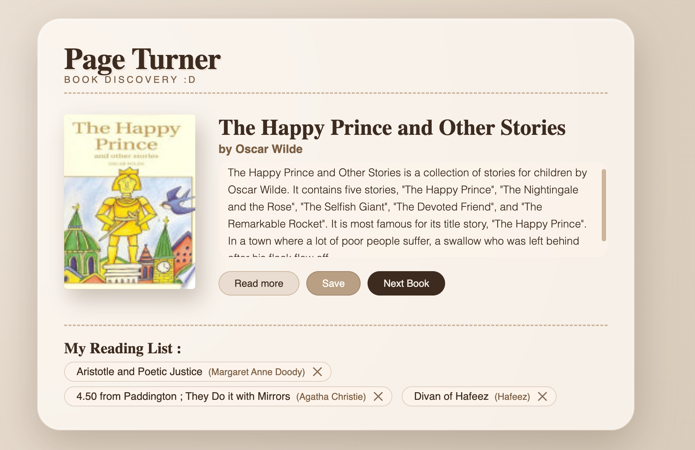
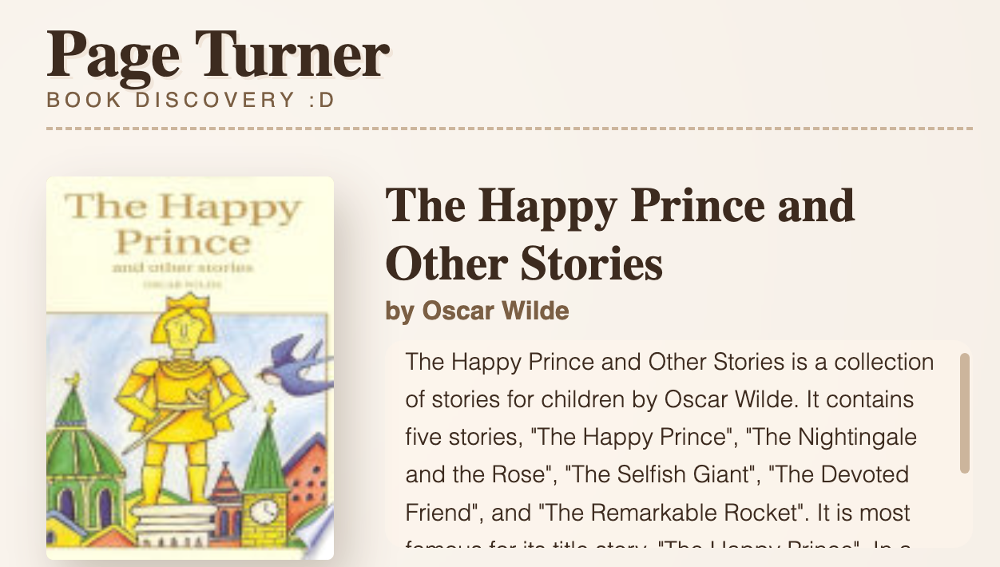
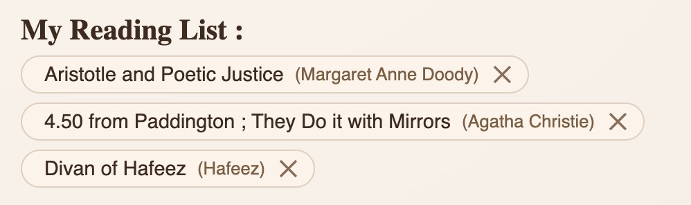

# Page Turner - a new tab for book lovers

## The Inspiration

Do you have trouble finding new books to read ?
I definetely do - i read voraciously, and have already finished most the classics, so i have trouble finding book recommendations
I always want to try something new, not the same fantasy or sci-fi tropes - i recently read _The Fault in Our Stars_ and _The Cosmere_ and thought :

Why hadn't i explored these Genre's before ? The answer is : My recommendations weren't exotic.

To fix this problem, i think the best way to do this is not the standard _choose genre_ -> **see top books**. Even though this might be good for others, it isn't for me.
Instead i want to _completely_ **randomize** my book recommendations - and get as many as possible without being overwhelmed - to make it as interesting as possible.

## The Idea :

This is exactly the core idea of Page Turner - you make **completely random** book recommendations part of the everyday,
by getting them directly in the new tab page !

So the idea's i had for the project that i was actually able to use were these :

- A recommendation with a title, a book cover, and a quick description of the book

- a direct link to the books actual google books page

- A way to save the books u find interesting (cause i always forget book names)

- a way to reload and not lose the book you were on
- skip to next book (bookscrolling instead of doomscrollin :P)

## The Implementation :

The site was built using pure html, css and javascript, using vite and npm.

It uses the Google Books API to fetch book descriptions, cover pages and titles - and the links to the books.
